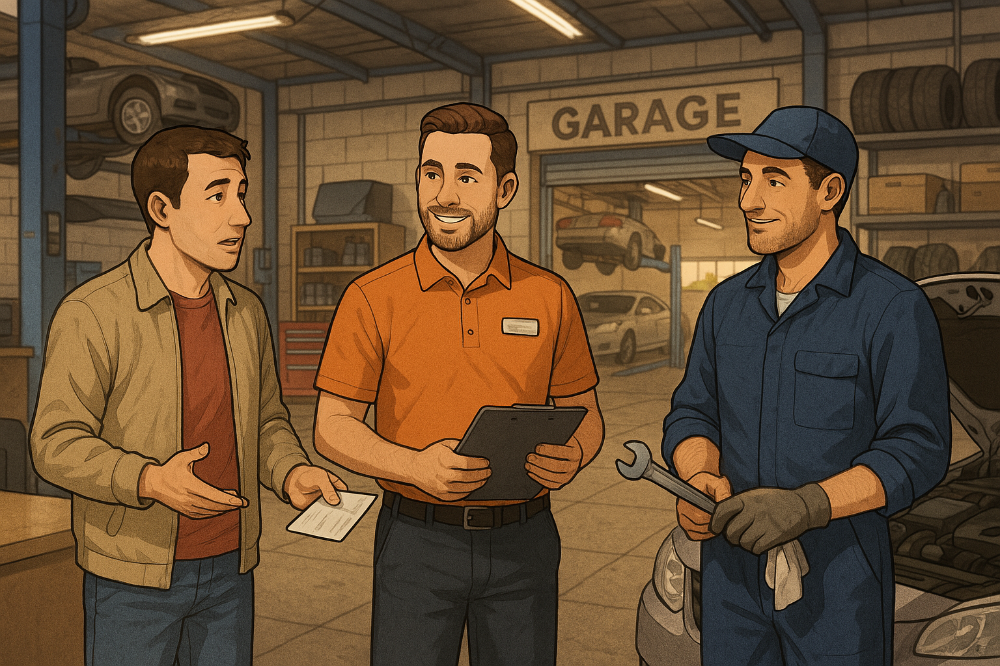
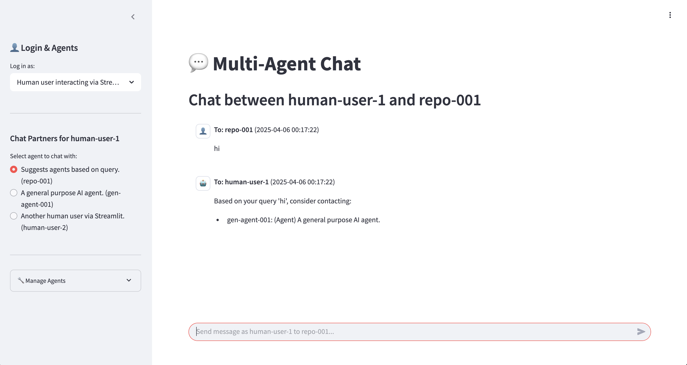
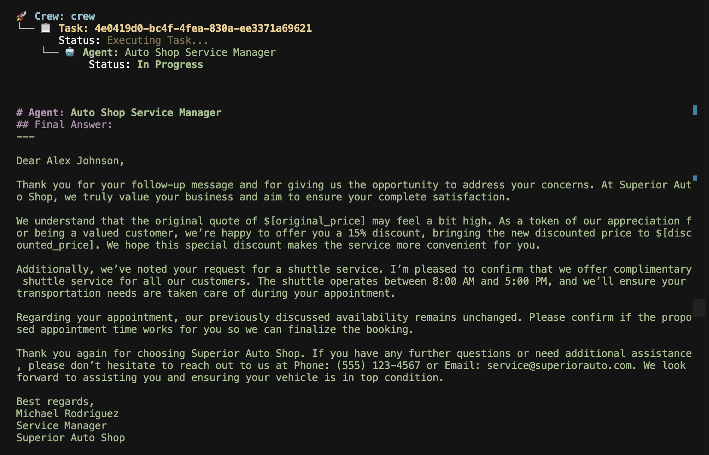

# Digital Twins + Agent Coordination Hackathon
https://lu.ma/szdqy6za?tk=mgXQBm



## High-level Concept
Presentation: [Google slides](https://docs.google.com/presentation/d/1VcWfXCJoDVdYVtQ9OCniQdh3em1Dv6trCLozbnXeGnA/edit?usp=sharing)

# Car Service Agents

Demo: [mefyi.com/hack](https://mefyi.com/hack)

## Demo Applications

This repository contains two demo applications demonstrating multi-agent AI systems.

### Demo 1: Multi-Agent Chat (hack.py)

A Streamlit-based application that implements a multi-agent chat system using Google's Gemini API. Key features include:

- **Multiple Agent Types**: Supports "Agent", "Repository Agent", and "Physical Agent" types
- **Dynamic Agent Creation**: Create new agents with custom roles and system prompts
- **Inter-Agent Communication**: Agents can send messages to each other and receive responses
- **UI-Based Interaction**: User-friendly interface for logging in as different agents and managing communications
- **Memory**: Conversations are stored in session state and can be referenced by agents

The system demonstrates how multiple AI and human agents can coordinate in a shared environment with different roles and capabilities.



### Demo 2: Car Service Workflow (agent2.py)

A simulation of an automotive repair service workflow using CrewAI. The system models the interactions between:

- **Car Owner**: Customer requesting service for their vehicle
- **Auto Shop Service Manager**: Handles customer inquiries, generates quotes, and schedules appointments
- **Auto Mechanic**: Performs maintenance and identifies additional repair needs

The workflow includes:
1. Initial customer service request
2. Shop manager generating a quote and availability
3. Price negotiation and shuttle service arrangement
4. Car drop-off and service assignment
5. Maintenance performed by the mechanic
6. Service completion and customer pickup

This demo showcases how agent-based systems can model complex business processes with multiple stakeholders, specialized tools, and sequential workflows.



## Getting Started

To run either demo, install the required dependencies and configure the necessary API keys as specified in each file.

### Environment Setup

1. Copy the `.env.example` file to a new file named `.env`:
   ```
   cp .env.example .env
   ```

2. Edit the `.env` file and replace the placeholder values with your actual API keys:
   - Get an OpenRouter API key from [OpenRouter](https://openrouter.ai/) for the CrewAI car service demo
   - Get a Gemini API key from [Google AI Studio](https://ai.google.dev/) for the chat demo

3. Install the required dependencies:
   ```
   pip install -r requirements.txt
   ```

4. Run the desired demo:
   ```
   # For Demo 1 (Multi-Agent Chat)
   streamlit run hack.py
   
   # For Demo 2 (Car Service Workflow)
   python agent2.py
   ```
